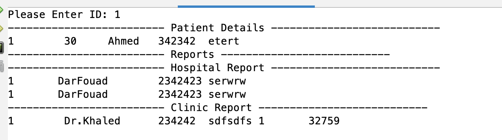
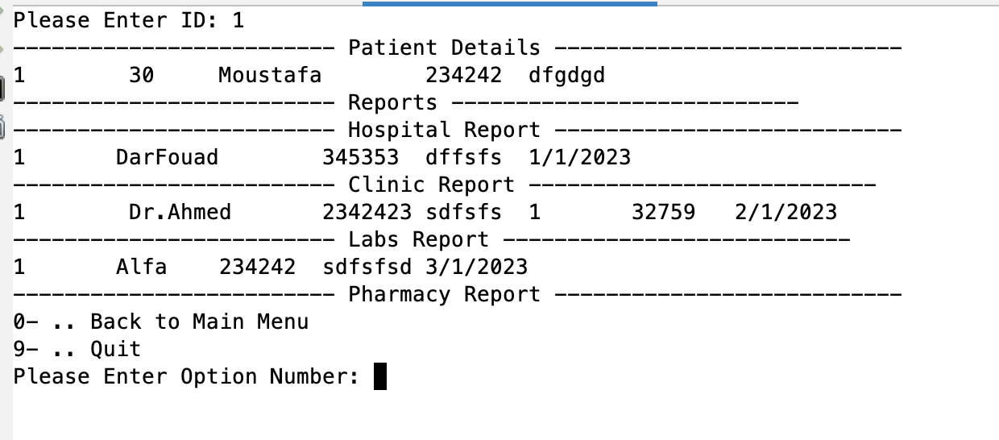
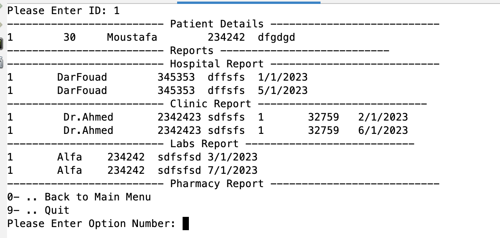

# Medical Care System Project
## Medical Care System (C++) - Data Structure
* 31 Dec 2022

* 1- Hospital
* 2- Clinic
* 3- Labs
* 4- x-Rays
* 5- Pharmacy
* 6- Blood Bank
* 7- Doctors
* 8- Patients
* 9- Quit

# Our Team:
* Mahhmoud Farag
* Mostafa Abobakr
* Ahmed Abdel Aziz
* Hossam Shalaby

# Youtube Vedios:
Medical Care System Part 1

Medical Care System Part 2

Medical Care System Part 3

Medical Care System Part 4

